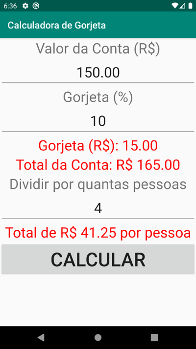

# Atividade 1 - Calculadora de Gorjeta

Utilizando todo o seu conhecimento adquirido sobre Android até a última de Tópicos Avançados de TI, construa uma calculadora de gorjeta minimamente funcional, seguindo o modelo da imagem a seguir.

- **Valor da Conta (R$)**, **Gorjeta (%)** e **Dividir por quantas pessoas** são campos de entrada de dados informados pelo usuário.
- A única ação da tela acontece ao clicar no botão **CALCULAR**.
- Os campos de texto em vermelho são calculados sempre que o botão for acionado.